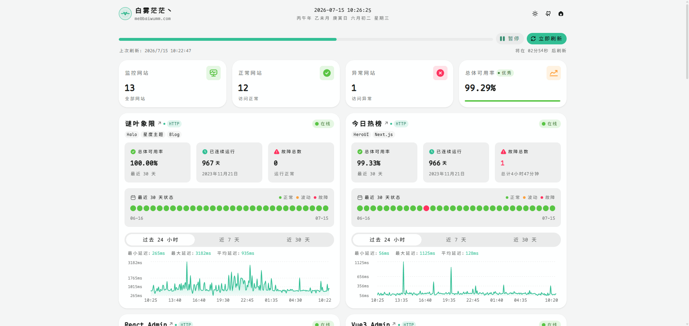
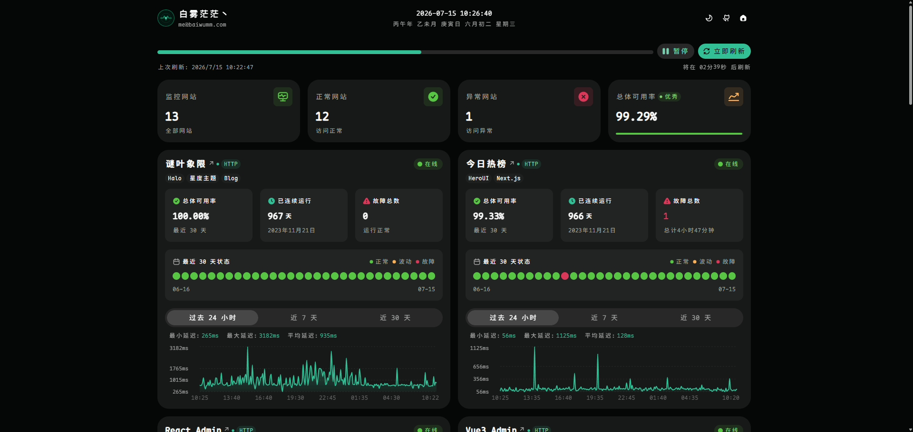

<div align="center">

</div>

<div align="center">
  <a href="https://vercel.com" target="_blank">
    
  </a>
  <a href="https://nextjs.org/" target="_blank">
    
  </a>
  <a href="https://www.heroui.com/" target="_blank">
    
  </a>
  <a href="https://tailwindcss.com/" target="_blank">
    
  </a>
  <a href="./LICENSE" target="_blank">
    
  </a>
</div>

## 🚀 项目简介

基于 [Next.js](https://nextjs.org/) 构建的 [UptimeRobot API](https://uptimerobot.com/) 站点监控平台，实时监测网站运行状态，提供可视化报表与提醒功能，帮助你快速掌握服务可用性与性能健康状况。

## 💻 演示预览

<div align="center">
  <h3>🌞 亮色模式</h3>
  
  
  <h3>🌙 暗色模式</h3>
  
</div>

## 🌟 特性

- 📊 实时监控网站状态（在线/离线/暂停）
- 📈 监控健康概览（总体可用率、可视化响应时间图表）
- 📅 故障记录查看
- 🎨 响应式设计，支持深色/浅色主题
- ⚡ 动画效果，流畅用户体验
- 📱 移动端适配

## 🛠 技术栈

- [Next.js 16](https://nextjs.org/) - React 框架(基于 React19.x)
- [Hero UI](https://www.heroui.com) - UI 库
- [TypeScript](https://www.typescriptlang.org/) - 类型安全
- [Tailwind CSS](https://tailwindcss.com/) - 样式框架
- [Motion](https://motion.dev/) - 动画库
- [UptimeRobot API](https://uptimerobot.com/api) - 网站监控服务

## 📦 安装

1. 克隆项目

```bash
git clone https://github.com/baiwumm/better-status.git
```

2. 安装依赖

```bash
cd better-status
pnpm install
```

3. 配置环境变量

创建 `.env` 文件并添加以下配置：

```env
# UptimeRobot API Key
UPTIMEROBOT_API_KEY = "xxx"

# 网站域名
NEXT_PUBLIC_APP_URL = 'https://status.baiwumm.com'
# 网站名称
NEXT_PUBLIC_APP_NAME = 'Better Status'
# 网站描述
NEXT_PUBLIC_APP_DESC = '一个优雅的站点状态监控面板'
# 网站关键词
NEXT_PUBLIC_APP_KEYWORDS = 'Better Status,UptimeRobot, 网站监控, API监控, 服务可用性, 站点状态, 网站宕机检测, 服务器健康监测, 实时监控, 可视化报表'
# 网站ICP
NEXT_PUBLIC_SITE_ICP = '粤ICP备2023007649号'
# 网站公网备案
NEXT_PUBLIC_SITE_GUAN_ICP = '粤公网安备44030402006402号'
# 版权
NEXT_PUBLIC_COPYRIGHT = '白雾茫茫丶'
# 检测频率/分钟，限制范围：1-60
NEXT_PUBLIC_INTERVAL = '5'
```

4. 启动开发服务器

```bash
pnpm dev
```

访问 http://localhost:3000 查看应用。

## 🚀 Vercel 一键部署

[](https://vercel.com/new/clone?repository-url=https://github.com/baiwumm/better-status)

**手动部署步骤：**

1. Fork 本项目到你的 GitHub 账户
2. 在 [Vercel](https://vercel.com/dashboard) 中点击 "New Project"
3. 选择你 Fork 的项目仓库
4. 保持默认配置，点击 "Deploy"
5. 等待部署完成，获取访问链接


## 🤝 贡献

欢迎提交 Issue 和 Pull Request 来帮助改进这个项目。

## 📄 许可证

本项目基于 [MIT 许可证]( LICENSE) 开源。

## ⭐ Star History

<a href="https://www.star-history.com/?repos=baiwumm%2Fbetter-status&type=date&legend=top-left">
 <picture>
   <source media="(prefers-color-scheme: dark)" srcset="https://api.star-history.com/chart?repos=baiwumm/better-status&type=date&theme=dark&legend=top-left&sealed_token=c0KyPLz5R9BJB5n0COhuHyiZMrPzRrG_eYVhwm8ShH_IJT_3pktc2U5VAmEl6mFNW3-NxjbX_PQZki3u7NEUD0rAhB_9lscsqm9slYvJuIuAFih1z_ePvA" />
   <source media="(prefers-color-scheme: light)" srcset="https://api.star-history.com/chart?repos=baiwumm/better-status&type=date&legend=top-left&sealed_token=c0KyPLz5R9BJB5n0COhuHyiZMrPzRrG_eYVhwm8ShH_IJT_3pktc2U5VAmEl6mFNW3-NxjbX_PQZki3u7NEUD0rAhB_9lscsqm9slYvJuIuAFih1z_ePvA" />
   
 </picture>
</a>